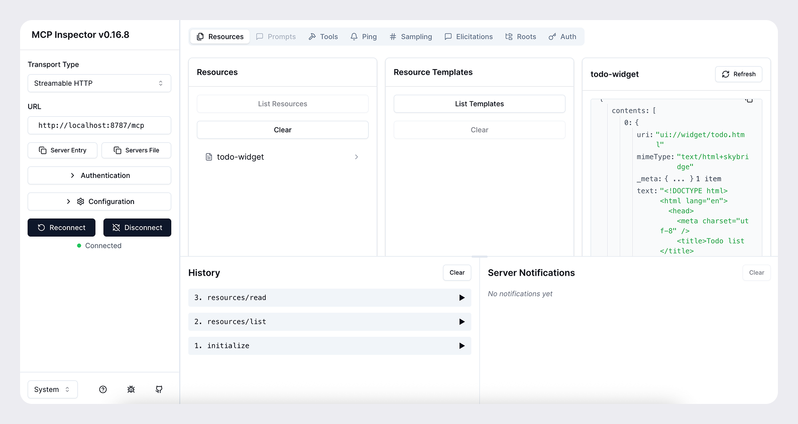
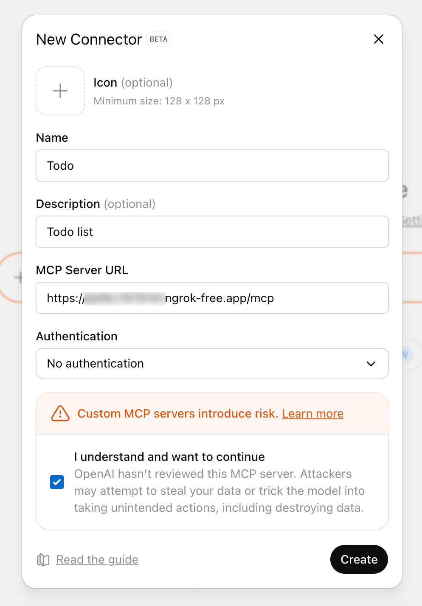
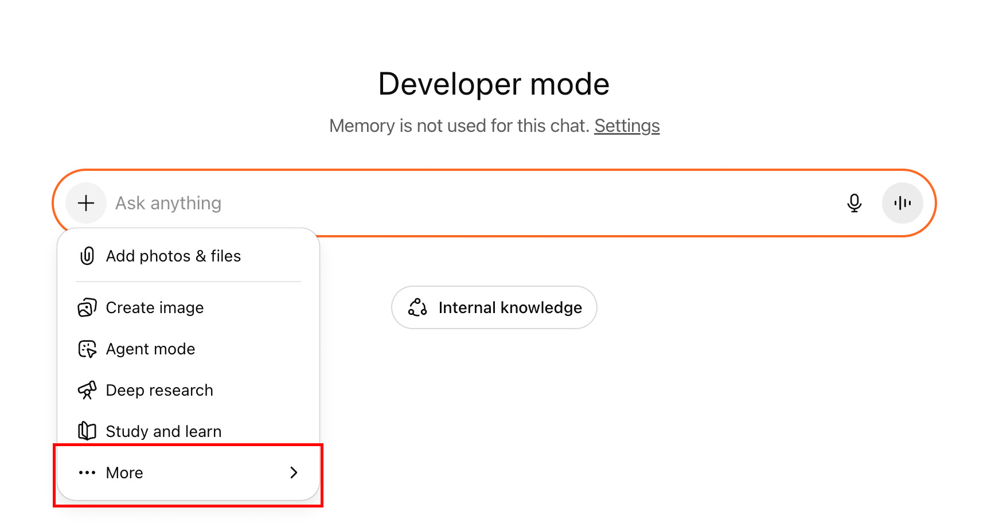

# mcp-app-python — Minimal MCP app with HTML widget

This repository demonstrates a minimal **MCP (Model-Connected Plugin)** server written in Python that exposes a single tool and an HTML widget resource. The widget is a small interactive HTML file (`widget.html`) that can be rendered by a client when the tool runs. The server uses a `FastMCP` helper and a small set of MCP types to register tools and resources and to handle resource and tool requests.

---

(MCP &#40;Model Context Protocol&#41; is a standard for letting AI models access external tools, information, and UI components in a secure, structured way. MCP servers provide:)
- **Tools**: Functions called by AI for executing logic.
- **Resources**: Data sources made available to the AI.
- **Widgets**: HTML or UI components that can be shown inside AI interfaces.

For more details, visit 
- https://modelcontextprotocol.io
- https://developers.openai.com/apps-sdk/quickstart
- https://developers.openai.com/apps-sdk/build/mcp-server#structure-the-data-your-tool-returns

---

## 🧪Getting Started

## Repo structure

```
mcp-app-python/
├── server-html.py        # MCP server + tool & resource registration
└── widget.html           # Example HTML widget UI
```

> Note: The code examples in this README are taken from `server-html.py` and `widget.html` included in this repo.

---

## Quick summary (one-line)

Run `server-html.py` with an ASGI server (e.g. `uvicorn`) to expose a minimal MCP server that lists a single tool (`show-widget`) and a single resource (the example widget HTML), and which returns structured content when the tool is called.

---

## Files explained step-by-step

### `server-html.py`

This file contains the MCP server implementation. Below are the important parts, explained in order.

### Imports & constants

```py
from pathlib import Path
from mcp.server.fastmcp import FastMCP
import mcp.types as types
from pydantic import BaseModel, Field

HTML_PATH = Path(__file__).parent / "widget.html"
HTML_TEXT = HTML_PATH.read_text(encoding="utf8")

MIME_TYPE = "text/html+skybridge"
WIDGET_URI = "ui://widget/example.html"
```

* `Path` reads the `widget.html` file from disk so the resource handler can serve it as text.
* `FastMCP` is a helper class that sets up an MCP server (helper from the `mcp` package you have in your environment).
* `mcp.types` contains typed message classes used by the MCP server for tool and resource definitions and request/response types.
* `HTML_TEXT` stores the raw contents of `widget.html` so we can return it in resource requests.
* `MIME_TYPE` is the mime type used to mark this resource as an HTML widget consumable by the front-end. The example uses `text/html+skybridge` — the `+skybridge` suffix indicates a custom widget usage convention (this is app-specific and the front-end must recognize it).
* `WIDGET_URI` is the unique identifier/URI the MCP server and client agree on for this widget. The `openai/outputTemplate` metadata uses this value so that tool outputs can instruct the client to render this URI as a widget.

### Input schema model

```py
class WidgetInput(BaseModel):
    pizzaTopping: str = Field(..., description="Topping to render.")
```

* `WidgetInput` is a Pydantic model describing the expected structured input for the tool. This isn't strictly required by the MCP server, but it documents and validates the JSON shape if you choose to use it.

### Create MCP instance

```py
mcp = FastMCP(name="minimal-mcp", stateless_http=True)
```

* `name` identifies the MCP server.
* `stateless_http=True` indicates the server expects stateless HTTP usage (each request contains all the data needed). Implementation details depend on `FastMCP`.

### list_tools handler

```py
@mcp._mcp_server.list_tools()
async def list_tools():
    return [
        types.Tool(
            name="show-widget",
            title="Show Widget",
            description="Render the example widget.",
            inputSchema={
                "type": "object",
                "properties": {
                    "pizzaTopping": {"type": "string"}
                },
                "required": ["pizzaTopping"],
            },
            _meta={
                "openai/outputTemplate": WIDGET_URI,
                "openai/widgetAccessible": True,
                "openai/resultCanProduceWidget": True,
            },
        )
    ]
```

* This registers a single tool called `show-widget`.
* `inputSchema` defines the JSON schema the tool expects: an object with a required `pizzaTopping` string property.
* `_meta` contains several keys that are important for the front-end / client integration:

  * `openai/outputTemplate` is set to `WIDGET_URI`. This tells the client SDK that when this tool is invoked it may produce an output that should be rendered using the widget at `ui://widget/example.html`.
  * `openai/widgetAccessible: True` marks the tool as capable of triggering widget rendering.
  * `openai/resultCanProduceWidget: True` signals that the tool's result may produce a widget (and the platform should check `list_resources()` to find that resource).

### list_resources handler

```py
@mcp._mcp_server.list_resources()
async def list_resources():
    return [
        types.Resource(
            name="example-widget",
            title="Example Widget",
            uri=WIDGET_URI,
            description="Example widget HTML.",
            mimeType=MIME_TYPE,
        )
    ]
```

* This registers one resource representing the HTML widget. Clients will call the server for the `uri` when they want to fetch widget content.
* `mimeType` is the type returned to the client so it knows how to treat the resource.

### Resource request handler mapping

```py
async def handle_resource(req: types.ReadResourceRequest):
    return types.ServerResult(
        types.ReadResourceResult(
            contents=[
                types.TextResourceContents(
                    uri=WIDGET_URI,
                    mimeType=MIME_TYPE,
                    text=HTML_TEXT,
                )
            ]
        )
    )

mcp._mcp_server.request_handlers[types.ReadResourceRequest] = handle_resource
```

* This function handles incoming `ReadResourceRequest` requests from the client. When the client fetches the registered resource it gets back a `ReadResourceResult` containing `TextResourceContents` with the `widget.html` text.
* The handler is registered by assigning it into `mcp._mcp_server.request_handlers` keyed by the request type class.

### Tool call handler mapping

```py
async def call_tool(req: types.CallToolRequest):
    args = req.params.arguments or {}
    topping = args.get("pizzaTopping", "")

    return types.ServerResult(
        types.CallToolResult(
            content=[types.TextContent(type="text", text=f"Widget rendered!")],
            structuredContent={"pizzaTopping": topping},
        )
    )

mcp._mcp_server.request_handlers[types.CallToolRequest] = call_tool
```

* When a client calls the `show-widget` tool, it will reach this handler.
* `req.params.arguments` contains the JSON arguments sent by the client (for example `{"pizzaTopping": "pepperoni"}`).
* The handler returns a `CallToolResult` with two useful pieces of information:

  * `content`: an array of `TextContent` entries that are human-readable text results. Here it's `"Widget rendered!"`.
  * `structuredContent`: a JSON object with structured data. Here it returns `{"pizzaTopping": <the provided value>}`. The client-side widget can read this structured content and render UI accordingly.

Because the tool metadata included `openai/outputTemplate` pointing to `WIDGET_URI`, the client can choose to render the resource at `WIDGET_URI` and expose `window.openai.toolOutput` (or similar) inside that widget so the widget can read `structuredContent`.

### Expose the ASGI app & run server

```py
app = mcp.streamable_http_app()

if __name__ == "__main__":
    import uvicorn

    uvicorn.run(app, host="0.0.0.0", port=8000)
```

* `streamable_http_app()` exposes the MCP server as an ASGI app that a web server (here `uvicorn`) can run.
* Running `python server-html.py` will start the server on port `8000` (if `uvicorn` is installed). You may prefer `uvicorn server-html:app --reload` during development.

---

### `widget.html` (the client-side widget)

This is a plain HTML file that shows a very small chat-like UI. Important details:

* It expects the hosting environment to expose `window.openai?.toolOutput` and `window.openai?.toolResponseMetadata` (these names come from the example / platform SDK). The MCP client that renders the widget should set `window.openai.toolOutput` to the structured content returned from the tool call so the HTML can read it.

* The script reads `output` and `meta` (if available) and prints them into the mini chat UI:

```js
const output = window.openai?.toolOutput;

if (output && typeof output === "object") {
    bot("Received from server (structuredContent):");
    bot(JSON.stringify(output, null, 2));

    if (output.pizzaTopping) {
        bot("🍕 Your topping from the server is: " + output.pizzaTopping);
    }
}
```

* The `form` in the HTML doesn't actually send data back to the MCP server in this minimal example — it only appends messages locally. In a production widget you would probably call a client SDK method to invoke the tool or send messages back.

* The UI contains a welcome message and an input where the user can type a pizza topping. The local UI then shows a local response `Here is your pizza with <topping>` when submitted.

---

## How the widget is expected to be used by a client (high level)

1. Client requests `/list_tools` from the MCP server and discovers the `show-widget` tool and its `_meta` that points to `ui://widget/example.html`.
2. Client requests `/list_resources` and confirms that `ui://widget/example.html` is available as a `text/html+skybridge` resource.
3. When the client invokes `call_tool` for `show-widget` with arguments like `{"pizzaTopping": "mushrooms"}`, the MCP server returns a `CallToolResult` whose `structuredContent` contains `pizzaTopping: "mushrooms"`.
4. Because the tool had `openai/outputTemplate` set to the widget's URI, the client knows to fetch the widget resource (the HTML) and render it in a sandboxed iframe or widget renderer.
5. Before or right after inserting the widget into the DOM, the client SDK sets `window.openai.toolOutput` inside the widget iframe so the widget can read the structured content and show `"🍕 Your topping from the server is: mushrooms"`.

This pattern separates *the tool result* (structured JSON + text) from *how the client chooses to display* a richer UI (the HTML widget resource).

---

## Installation & running (recommended)

1. Create a Python virtual environment (recommended):

```bash
python -m venv .venv
source .venv/bin/activate   # macOS / Linux
.\.venv\Scripts\activate  # Windows PowerShell
```

2. Install dependencies. You can create a `requirements.txt` with at least:

```
mcp==1.21.2
fastmcp==2.13.1
uvicorn
pydantic
```

and then 

```bash
pip install -r requirements.txt
```


3. Run the server:

```bash
uvicorn server-html:app --reload --host 0.0.0.0 --port 8000
```

Or run directly (this will start uvicorn inside the script):

```bash
python server-html.py
```
---
## Test with MCP Inspector
1. Use MCP Inspector with the following command then you can see MCP inspector client open in your browser
2. Enter http://0.0.0.0:8000/mcp in the URL and Transport should be Streamable HTTP:
3. Click on connect --> It should connect to the local MCP server running on 8000

```bash
(npx @modelcontextprotocol/inspector)
```

* click on `list tools`
* click on `list resources`
* click on the tool `show-widget` with `{"pizzaTopping": "pepperoni"}`


---

## Example `CallTool` request & response (JSON)

**Request using CURL**:
```
  curl -X POST http://localhost:8000/mcp \
  -H "Accept: application/json, text/event-stream" \
  -H "Content-Type: application/json" \
  -d '{
    "jsonrpc":"2.0",
    "id":1,
    "method":"resources/read",
    "params": {"uri":"ui://widget/example.html"}
  }' \
| grep '^data:' | sed 's/^data: //' \
| jq -r '.result.contents[0].text'\
> widget_test.html
```
**Response you can find it in your local repo with the filename widget_test.html**:

**Example Request** (simplified):

```json
{
  "method": "CallTool",
  "params": {
    "tool": "show-widget",
    "arguments": {"pizzaTopping": "pepperoni"}
  }
}
```

**Server response** (simplified):

```json
{
  "result": {
    "content": [{"type": "text", "text": "Widget rendered!"}],
    "structuredContent": {"pizzaTopping": "pepperoni"}
  }
}
```

A conforming client will take the `structuredContent`, fetch the `ui://widget/example.html` resource via `ReadResource`, and then inject the `structuredContent` into the widget environment (e.g. `window.openai.toolOutput`) so the widget can render it.

---
## Testing in ChatGPT

To add these apps to ChatGPT, enable developer mode, and add your apps in Settings > Connectors.

### Expose your server to the public internet

For ChatGPT to access your server during development, you need to expose it to the public internet. You can use a tool such as ngrok to open a tunnel to your local server.

```
ngrok http <port>
```
This will give you a public URL like https://<subdomain>.ngrok.app that you can use to access your server from ChatGPT.

When you add you connector, provide the public URL with the /mcp path (e.g. https://<subdomain>.ngrok.app/mcp).

### Add your app to ChatGPT

Once you have your MCP server and web component working locally, you can add your app to ChatGPT with the following steps:
1. Enable developer mode under Settings → Apps & Connectors → Advanced settings in ChatGPT.
2. Click the Create button to add a connector under Settings → Connectors and paste the HTTPS + /mcp URL from your tunnel or deployment (e.g. https://<subdomain>.ngrok.app/mcp).
3. Name the connector, provide a short description and click Create.
4. Open a new chat, add your connector from the More menu (accessible after clicking the + button), and prompt the model. ChatGPT will stream tool payloads so you can confirm inputs and outputs.

---
## Key integration points (what to pay attention to)

* **`WIDGET_URI` and `_meta["openai/outputTemplate"]`**: these must match. They are the contract between the tool definition and the widget resource.
* **`mimeType`**: Make sure the client knows how to handle `text/html+skybridge`. If your client expects `text/html` exactly, adapt accordingly.
* **`structuredContent`**: This is how you send machine-readable data to the widget. Keep it small and predictable.

---

## Troubleshooting

* If the widget doesn't render, check the following:

  * The client properly calls `list_tools` and `list_resources` and maps `openai/outputTemplate` to a resource URI.
  * The client fetches the resource via the MCP `ReadResource` flow and injects `structuredContent` into the widget environment.
  * MIME type mismatches — ensure the client knows how to treat `text/html+skybridge` resources.

* If `HTML_TEXT` fails to load on startup, verify `widget.html` is present and readable where `server-html.py` expects it.

---
